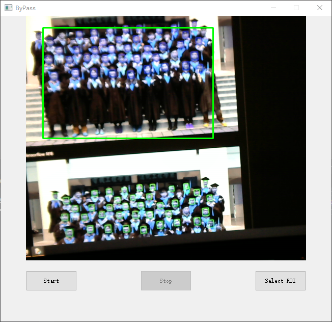

# ByPassBoss

门口老有老板串门怎么办?

监控呗!

本项目意在监控选区是否有人脸出现,并触发最小化界面操作

## 依赖

使用前请先安装如下依赖

```ini
3.11.0 < python <= 3.10.7

# 此项请参考 https://pytorch.org/get-started/previous-versions/#v250
# 使用如下命令安装
# pip install torch==2.5.0 torchvision==0.20.0 torchaudio==2.5.0 --index-url https://download.pytorch.org/whl/cu124
torch==2.5.0

# 以下请在torch安装后直接使用如下命令安装
# pip install -r requirements.txt
tensorflow==2.12.1
opencv-python==4.10.0.84
pynput
pygetwindow
plyer
win10toast
PyQt5
```

## 启动方式

`双击 start.bat`

## 运行截图





## 鸣谢

- [Ultra-Light-Fast-Generic-Face-Detector_Tensorflow-Model-Converter](https://github.com/jason9075/Ultra-Light-Fast-Generic-Face-Detector_Tensorflow-Model-Converter)

- [Ultra-Light-Fast-Generic-Face-Detector-1MB](https://github.com/Linzaer/Ultra-Light-Fast-Generic-Face-Detector-1MB)